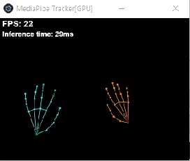

# MediaPipe GPU Tracker

Electron의 Chromium/WebGL에서 MediaPipe Tasks Vision GPU delegate를 실행하고, 추적 결과를 Unreal Engine에 TCP로 전달하는 Windows 우선 데스크톱 앱이다.



## 주요 기능

- Face Landmarker: 52개 blendshape와 4×4 facial transformation matrix
- Hand Landmarker: 양손 normalized/world landmark
- Pose Landmarker Lite: 33개 normalized landmark
- 카메라 4:3/16:9 입력과 좌우 반전 미리보기
- `127.0.0.1:33685` 자동 재연결
- 모델과 MediaPipe WASM을 앱 패키지에 포함한 오프라인 실행

## 개발 실행

```bash
npm install
npm start
```

Linux 개발 환경에서는 Electron 실행에 `libasound.so.2` 등 Chromium 시스템 라이브러리가 필요하다. 실제 대상 플랫폼은 Windows x64다.

## 검증과 패키징

```bash
npm run lint
npx tsc --noEmit
npm run package -- --platform=win32 --arch=x64
```

Windows 패키지는 `out/MediaPipe GPU Tracker-win32-x64/`에 생성된다. 폴더 전체를 함께 배포해야 하며, 실행 파일만 분리하면 동작하지 않는다.

## 실행과 제어

1. Unreal 측 TCP 서버를 `127.0.0.1:33685`에서 시작한다.
2. `MediaPipe GPU Tracker.exe [camera_index] [use_16_9]` 형식으로 실행한다.
3. 앱은 별도 조작 없이 즉시 카메라와 GPU 추적을 시작한다.
4. 실행 후 제어는 VTuberController가 TCP 명령으로 담당한다.

예시:

```text
MediaPipe GPU Tracker.exe 0 0
MediaPipe GPU Tracker.exe 1 1
```

- 첫 번째 인자: 0부터 시작하는 카메라 인덱스
- 두 번째 인자: `0`은 4:3 640×480, `1`은 16:9 640×360
- 창 콘텐츠는 320×240 고정 미리보기이며 FPS와 추론 시간을 표시한다.

## Unreal 프로토콜

앱은 10ms 간격으로 최신 payload를 반복 전송한다.

```text
int32   protocol_id = 1001   // little-endian
uint32  float_count = 422    // little-endian
float32 payload[422]         // little-endian
```

Payload 인덱스는 참고 C++ 구현과 동일하다.

| 인덱스 | 내용 |
| --- | --- |
| 0 | Left hand present |
| 1..63 | Left hand normalized 21×xyz |
| 64..126 | Left hand world 21×xyz |
| 127 | Right hand present |
| 128..190 | Right hand normalized 21×xyz |
| 191..253 | Right hand world 21×xyz |
| 254..305 | Face blendshape 52 |
| 306..321 | Face matrix 4×4 |
| 322 | Pose present |
| 323..421 | Pose normalized 33×xyz |

Unreal에서 줄바꿈으로 구분해 보낼 수 있는 명령은 다음과 같다.

```text
setVideoVisible:true|false
setFaceTracking:true|false
setPoseTracking:true|false
setHandTracking:true|false
quit
```

미리보기는 기본적으로 검은 배경에 손 랜드마크만 표시한다. 카메라 영상을 함께
표시하려면 VTuberController에서 `setVideoVisible:true`를 전송한다.

## 모델 출처

모델은 Google MediaPipe 공식 배포 경로의 float16 revision 1을 사용한다.

- `face_landmarker.task`
- `hand_landmarker.task`
- `pose_landmarker_lite.task`

런타임 구현은 `@mediapipe/tasks-vision` 0.10.35를 사용한다.
